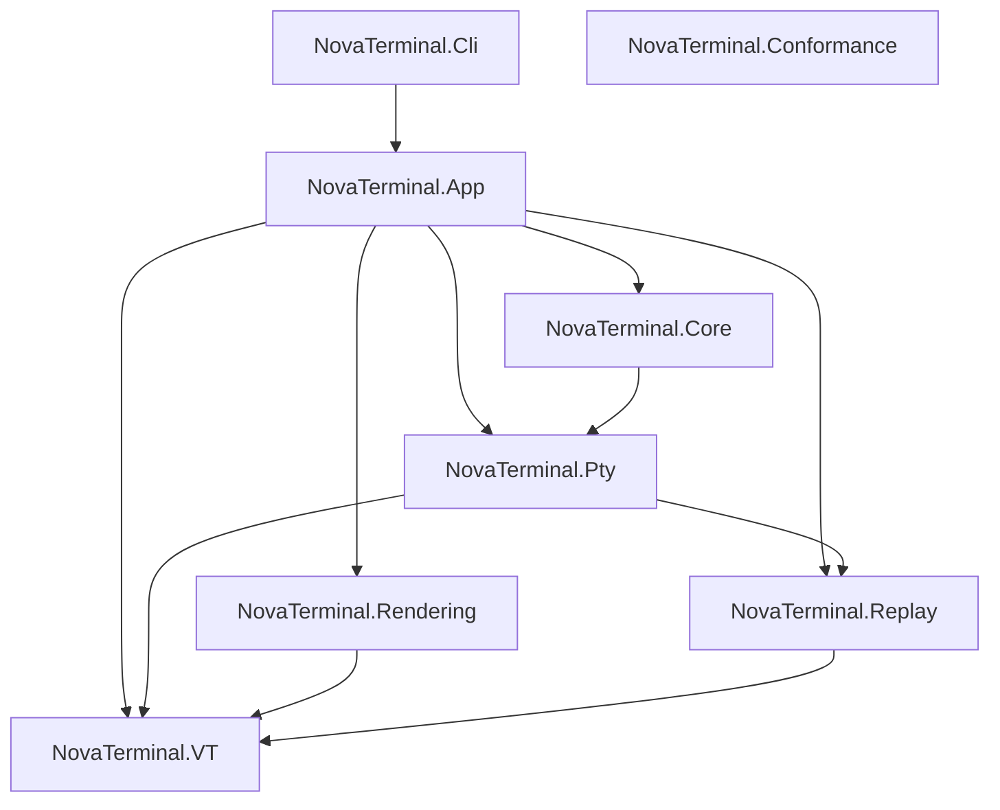

# NovaTerminal

**NovaTerminal** is a modern, cross-platform terminal emulator focused on
**correctness, performance, and predictability**.

Built with:

- **.NET 10**
- **Avalonia UI**
- **Skia (GPU-accelerated rendering)**
- **Rust-based PTY backend**

Supported platforms: **Windows · Linux · macOS**

---

### ✨ Why NovaTerminal?

Most terminal emulators optimize for speed or features. NovaTerminal focuses on something different:

-   🧪 **Deterministic rendering**\
    Same input → same output. Always. Enables reliable testing and replay.
-   📼 **Replay-driven debugging**\
    Record terminal sessions and replay them with pixel-level consistency.
-   ✅ **VT correctness first**\
    Built with conformance and standards in mind---not best-effort rendering.
-   ⚡ **GPU-accelerated rendering**\
    Smooth, modern rendering pipeline using Skia.
-   🧩 **Extensible architecture**\
    Designed for future workflows (cloud, automation, AI-assisted tooling).

> **Terminal correctness is enforced by automated tests, not guesswork.**

That principle shows up everywhere: VT behavior is measured against a
conformance matrix, the renderer is gated by performance contracts, and
replay parity prevents silent behavioral drift.

---

## Install

GitHub release assets are produced as Native AOT bundles for `win-x64`,
`linux-x64`, and `osx-arm64`. Installer packaging is not available yet, so
if a release does not include the bundle you need, build from source.

For build steps, jump to [Build & test](#build--test) below.

---

## Features

### Terminal core

- VT / ANSI parsing measured against a conformance matrix
- Alternate screen support (`vim`, `less`, `htop`)
- Scrollback buffer
- Stable resize & reflow
- Cell-based buffer model
- Thread-safe, crash-resistant PTY backend

### UI

- Tabs and split panes
- Command palette
- Search overlay
- Profiles (local & SSH)
- Themes and fonts
- Live settings (no restart)

### Graphics & inline images

- **Sixel Graphics** (verified with `libsixel`, `lsix`, `gnuplot`)
- **iTerm2 Inline Images** (verified with `imgcat`, `test_iterm2.py`)
- **Kitty Graphics Protocol** (native on Linux/macOS; tunneled mode on Windows)
- **Proper ConPTY synchronization** — images render inline with prompts

### Native SSH

- SSH profiles with platform-vault credential storage
- Keepalive and dynamic port forwarding
- Coalesced resize handling for fullscreen TUIs (vim, htop, tmux)
- Disconnect state surfaced in the terminal pane
- Runtime password memory (opt-in, session-scoped)

### Cross-platform parity
NovaTerminal guarantees identical terminal behavior across operating systems
for VT interpretation, buffer state, wrapping & reflow, and search semantics.
Platform-specific differences are limited to window chrome, blur/transparency,
global hotkeys, and credential storage backends.

---

## User documentation

- [User manual](docs/USER_MANUAL.md)
- [Tabs user manual](docs/TABS_USER_MANUAL.md)
- [Image protocol support](docs/IMAGE_PROTOCOL_SUPPORT.md)
- [SSH roadmap](docs/SSH_ROADMAP.md)

---

## For contributors & developers

### Architecture

NovaTerminal is organized into focused class libraries under `src/` with an
acyclic dependency graph.

- **[`src/NovaTerminal.App`](src/NovaTerminal.App/)** — Avalonia/UI layer: windows, themes, settings, orchestration.
- **[`src/NovaTerminal.Core`](src/NovaTerminal.Core/)** — Shared runtime primitives: input, paths, process, SSH.
- **[`src/NovaTerminal.VT`](src/NovaTerminal.VT/)** — Virtual Terminal engine: frame-agnostic parser logic and buffer state.
- **[`src/NovaTerminal.Rendering`](src/NovaTerminal.Rendering/)** — SkiaSharp rendering: framework-agnostic text shaping and GPU glyph caching.
- **[`src/NovaTerminal.Pty`](src/NovaTerminal.Pty/)** — Native OS integration and PTY session management.
- **[`src/NovaTerminal.Replay`](src/NovaTerminal.Replay/)** — Deterministic session recording and playback.
- **[`src/NovaTerminal.Conformance`](src/NovaTerminal.Conformance/)** — VT conformance matrix tooling and report generation.
- **[`src/NovaTerminal.Cli`](src/NovaTerminal.Cli/)** — Command-line shim (e.g. `vt-report`) for headless tooling.

Validation:

- **[`tests/NovaTerminal.Tests`](tests/NovaTerminal.Tests/)** — primary unit and integration suite (Headless UI).
- **[`tests/NovaTerminal.Benchmarks`](tests/NovaTerminal.Benchmarks/)** — performance and throughput benchmarks.



---

### Engineering programs

#### Active work

- **VT conformance program** — every supported VT/ANSI feature is tracked in a
  matrix; a dedicated CI lane regenerates the report and fails on regressions.
  See [`docs/vt_coverage_matrix.md`](docs/vt_coverage_matrix.md) and
  [`docs/ghostty-gaps/vt_conformance_tooling.md`](docs/ghostty-gaps/vt_conformance_tooling.md).
- **Ghostty gap closure** — systematic comparison against Ghostty's behavior
  with a roadmap for closing remaining gaps. See
  [`docs/ghostty-gaps/`](docs/ghostty-gaps/) and
  [`docs/vt_ghostty_gap_matrix.md`](docs/vt_ghostty_gap_matrix.md).
- **Native SSH** — cross-platform SSH client (experimental, opt-in) with VT
  correctness, resize coalescing, dynamic forwarding, keepalive, and runtime
  password memory. See [`docs/SSH_ROADMAP.md`](docs/SSH_ROADMAP.md) and
  [`docs/native-ssh/`](docs/native-ssh/).

#### Ongoing guardrails

- **Rendering performance contract** — snapshot-only rendering boundary,
  replay parity, seam safety under fractional DPI, and conservative perf
  ceilings enforced by CI. See
  [`docs/RENDERING_PERF_CONTRACT.md`](docs/RENDERING_PERF_CONTRACT.md).
  Historical design context:
  [`docs/gpu-hardening/`](docs/gpu-hardening/).

---

### Build & test

Prerequisites:

- .NET 10 SDK
- Rust toolchain (`rustup`, `cargo`) for native PTY builds

Build:

```bash
dotnet restore
dotnet build -c Release
```

Run tests (same main filter used by CI unit lane):

```bash
dotnet test -c Release --no-build --filter "Category!=Replay&Category!=RenderMetrics&Category!=PtySmoke"
```

Use `ci/run.sh` (Linux/macOS) or `ci/run.ps1` (Windows) for the full local
CI-style sequence.

### Native AOT publish

NovaTerminal is configured for **Native AOT** publish in
[`src/NovaTerminal.App/NovaTerminal.App.csproj`](src/NovaTerminal.App/NovaTerminal.App.csproj).
The project supports `win-x64`, `linux-x64`, and `osx-arm64` publish targets.
The release workflow publishes Native AOT bundles for those targets to the
corresponding GitHub Release.

Example publish command:

```bash
dotnet publish src/NovaTerminal.App/NovaTerminal.App.csproj -c Release -r win-x64 --self-contained true -p:PublishAot=true -o artifacts/publish/win-x64
```

Swap `win-x64` for `linux-x64` or `osx-arm64` as needed.

---

### Running GitHub CI locally with `act`

NovaTerminal workflows exchange artifacts between jobs (native binaries and
test results). When running via `act`, enable its artifact server or
artifact upload/download steps will fail.

Recommended command:

```bash
act pull_request -P ubuntu-latest=catthehacker/ubuntu:act-latest --artifact-server-path .act-artifacts
```

Notes:

- `--artifact-server-path` is required for `actions/upload-artifact` / `actions/download-artifact`.
- To bypass Rust rebuild inside downstream .NET jobs, set `--env SKIP_RUST_NATIVE_BUILD=1`.

---

### Project status

Under active development. Current focus and upcoming milestones are tracked
in [`docs/ROADMAP.md`](docs/ROADMAP.md).

License: [`MIT`](LICENSE).

---

### Contributing

Contributions are welcome. NovaTerminal has a strong correctness culture —
terminal core invariants are enforced and automated tests gate changes. See
[`CONTRIBUTING.md`](CONTRIBUTING.md) for details.

---

## Philosophy

NovaTerminal aims to be:

- **boring in behavior**
- **predictable under stress**
- **fast without shortcuts**
- **cross-platform without divergence**

A terminal you can trust.
