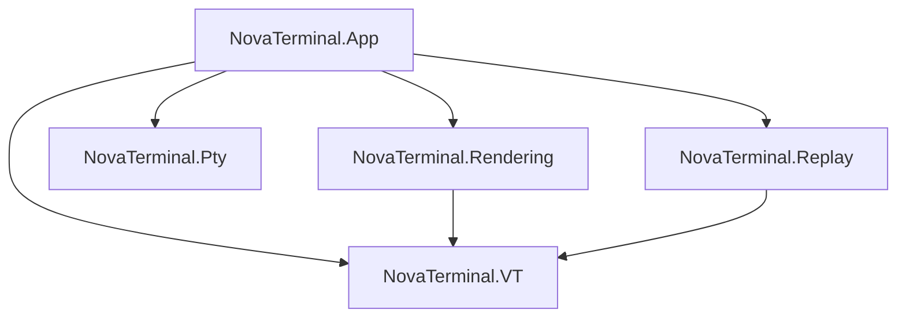

# NovaTerminal

**NovaTerminal** is a modern, cross-platform terminal emulator focused on  
**correctness, performance, and predictability**.

Built with:

- **.NET 10**
- **Avalonia UI**
- **Skia (GPU-accelerated rendering)**
- **Rust-based PTY backend**

Supported platforms: **Windows · Linux · macOS**

---

## Why NovaTerminal?

Terminal emulators tend to fail quietly:
a small bug in resize, wrapping, or alternate screen handling can break
`vim`, `htop`, `tmux`, or SSH workflows.

NovaTerminal is built around one core principle:

> **Terminal correctness is enforced by automated tests, not guesswork.**

---

## What Makes NovaTerminal Different

### ✔ High-Performance Skia Engine
- **Lock-Free Snapshot Pipeline**: Decouples terminal state from the UI thread for jitter-free performance during high-frequency output.
- **GPU-Accelerated Glyph Atlas**: Pre-caches shaped glyphs into a high-speed GPU texture for pixel-perfect text at high FPS.
- **Micro-Batching**: Optimizes redraws by grouping similar rendering operations (backgrounds, text, overlays).

### ✔ Correctness & Stability
- Deterministic VT / ANSI parsing
- Lossless resize & reflow
- Strict alternate screen isolation
- **Resource Hardening**: Defensive buffer management ensures stability even under extreme stress (e.g., rapid resizing).
- **Auth Hardening**: No terminal-output-triggered password injection; SSH password auth is manual interactive entry only.
- **Secret Migration Safety**: SSH secrets use canonical keying with backward-compatible legacy lookup migration.

---

### ✔ Truly Cross-Platform
NovaTerminal guarantees **identical terminal behavior** across operating systems:

- VT interpretation
- buffer state
- wrapping & reflow
- search semantics

Platform-specific differences are limited to:
- window chrome
- blur/transparency
- global hotkeys
- credential storage backends

---

### ✔ Test-Gated Development
NovaTerminal treats automated testing as a first-class feature:

- deterministic replay of real terminal sessions
- cross-platform parity checks from **runtime-generated artifacts** (not checked-in fixture snapshots)
- renderer performance & flicker guards
- nightly stress/performance/latency regression lanes

If a change cannot be tested, it does not ship.

---

## Architecture & Directory Structure

NovaTerminal is organized into focused class libraries under the `src/` directory to enforce a strict dependency Directed Acyclic Graph (DAG):

- **`src/NovaTerminal.App`**: The main Avalonia/UI layer. Orchestrates windows, themes, and settings.
- **`src/NovaTerminal.VT`**: The core Virtual Terminal engine. Frame-agnostic, parser-logic, and buffer state.
- **`src/NovaTerminal.Rendering`**: SkiaSharp-based rendering logic. Framework-agnostic text shaping and GPU glyph caching.
- **`src/NovaTerminal.Pty`**: Native OS integration and PTY session management.
- **`src/NovaTerminal.Replay`**: Deterministic session recording and playback logic.

### Validation
- **`tests/NovaTerminal.Tests`**: Primary unit and integration test suite (Headless UI).
- **`tests/NovaTerminal.Benchmarks`**: Performance and throughput benchmarks.



---

## Current Features

### Terminal
- VT / ANSI parsing
- Alternate screen support (`vim`, `less`, `htop`)
- Scrollback buffer
- Stable resize & reflow
- Cell-based buffer model
- Thread-safe, crash-resistant PTY backend

### Graphics & Protocol Support
- **Sixel Graphics** (Verified with `libsixel`, `lsix`, `gnuplot`)
- **iTerm2 Inline Images** (Verified with `imgcat`, `test_iterm2.py`)
- **Kitty Graphics Protocol** (native on Linux/macOS; tunneled mode on Windows)
- **Proper ConPTY Synchronization** (Images render inline with prompts)

See `documents/IMAGE_PROTOCOL_SUPPORT.md` for platform-specific protocol behavior and fallback rules.

### UI
- Tabs
- Split panes
- Command palette
- Search overlay
- Profiles (local & SSH)
- Themes and fonts
- Live settings (no restart)

See `documents/TABS_USER_MANUAL.md` for tabs behavior, shortcuts, workspace flows, and troubleshooting.

### Remote
- SSH profiles
- Cross-platform PTY abstraction
- Secure credential handling via platform vault backends with canonical SSH key schema migration

### Runtime Storage Model
NovaTerminal stores writable runtime data in user-scoped app data paths:

- settings
- themes
- logs
- session restore state
- recordings

This avoids requiring write access to the install directory and supports one-time migration from legacy locations.

---

## Project Status

NovaTerminal is under **active development**.

Recently completed:
- M1 VT completeness
- M2 core performance/stability
- M3 replay product core
- M4 cross-platform polish
- M4.5 production hardening (auth, vault keys, LocalAppData runtime paths, CI parity/nightly corrections)

Current focus:
- M5 ship readiness (beta workflow, release motion, launch docs/site)

---

## Build & Test Locally

Prerequisites:
- .NET 10 SDK
- Rust toolchain (`rustup`, `cargo`) for native PTY builds

Build:

```bash
dotnet restore
dotnet build -c Release
```

Run tests (same main filter used by CI unit lane):

```bash
dotnet test -c Release --no-build --filter "Category!=Replay&Category!=RenderMetrics&Category!=PtySmoke"
```

Use `ci/run.sh` (Linux/macOS) or `ci/run.ps1` (Windows) for the full local CI-style sequence.

---

## Run GitHub CI Locally with `act`

NovaTerminal workflows exchange artifacts between jobs (native binaries and test results).  
When running via `act`, enable its artifact server or artifact upload/download steps will fail.

Recommended command:

```bash
act pull_request -P ubuntu-latest=catthehacker/ubuntu:act-latest --artifact-server-path .act-artifacts
```

Notes:
- `--artifact-server-path` is required for `actions/upload-artifact` / `actions/download-artifact`.
- If you ever need to bypass Rust rebuild inside downstream .NET jobs, you can set:
  `--env SKIP_RUST_NATIVE_BUILD=1`

---

## Contributing

Contributions are welcome.

NovaTerminal has a strong correctness culture:
- terminal core invariants are enforced
- automated tests gate changes

See `CONTRIBUTING.md` for details.

---

## Philosophy

NovaTerminal aims to be:

- **boring in behavior**
- **predictable under stress**
- **fast without shortcuts**
- **cross-platform without divergence**

A terminal you can trust.
