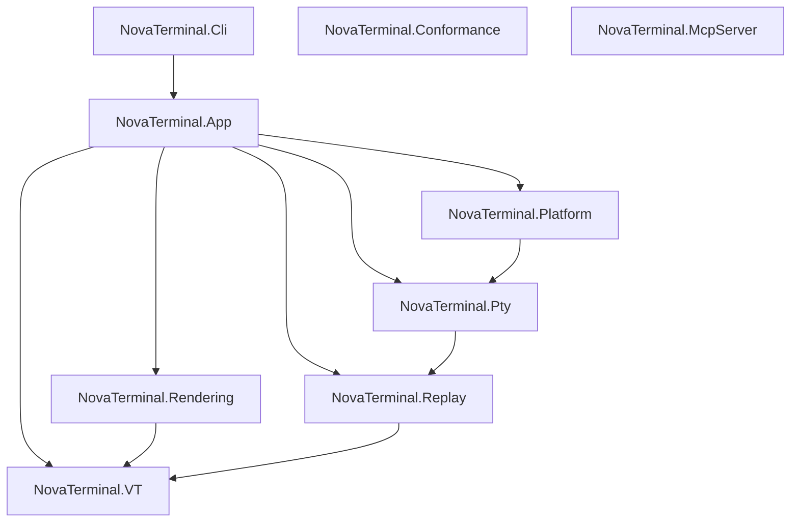

# NovaTerminal


**NovaTerminal** is a modern, cross-platform terminal emulator focused on

**correctness, performance, and predictability**.


Built with:

- **.NET 10**
- **Avalonia UI**
- **Skia (GPU-accelerated rendering)**
- **Rust-based PTY backend**

Supported platforms: **Windows · Linux · macOS**


---

### ✨ Why NovaTerminal?

Most terminal emulators optimize for speed or features. NovaTerminal focuses on something different:

-   🧪 **Deterministic rendering**\
    Same input → same output. Always. Enables reliable testing and replay.
-   📼 **Replay-driven debugging**\
    Record terminal sessions and replay them with pixel-level consistency.
-   ✅ **VT correctness first**\
    Built with conformance and standards in mind---not best-effort rendering.
-   ⚡ **GPU-accelerated rendering**\
    Smooth, modern rendering pipeline using Skia.
-   🧩 **Extensible architecture**\
    Designed for future workflows (cloud, automation, AI-assisted tooling).
-   🤖 **Built for AI agents**\
    An opt-in MCP server lets Claude Code and other agents observe your live terminal sessions --- and, behind a separate opt-in, drive them.

> **Terminal correctness is enforced by automated tests, not guesswork.**

That principle shows up everywhere: VT behavior is measured against a
conformance matrix, the renderer is gated by performance contracts, and
replay parity prevents silent behavioral drift.

---

## Install

GitHub release assets are produced as Native AOT bundles for `win-x64`,
`linux-x64`, and `osx-arm64`. Every release runs the gating unit-test lane on
all three OSes before any bundle is published. Installer packaging is not
available yet, so if a release does not include the bundle you need, build
from source.

For build steps, jump to [Build & test](#build--test) below.

---

## Features

### Terminal core

- VT / ANSI parsing measured against a conformance matrix
- Alternate screen support (`vim`, `less`, `htop`)
- Scrollback buffer
- Stable resize & reflow
- Cell-based buffer model
- Thread-safe, crash-resistant PTY backend

### UI

- Tabs and split panes
- Command palette
- Search overlay
- Profiles (local & SSH)
- Themes and fonts
- Live settings (no restart)

### Graphics & inline images

- **Sixel Graphics** (verified with `libsixel`, `lsix`, `gnuplot`)
- **iTerm2 Inline Images** (verified with `imgcat`, `test_iterm2.py`)
- **Kitty Graphics Protocol** (native on Linux/macOS; tunneled mode on Windows)
- **Proper ConPTY synchronization** — images render inline with prompts

### Native SSH

- SSH profiles with platform-vault credential storage
- Keepalive and dynamic port forwarding
- Coalesced resize handling for fullscreen TUIs (vim, htop, tmux)
- Disconnect state surfaced in the terminal pane
- Runtime password memory (opt-in, session-scoped)

### Cross-platform parity
NovaTerminal guarantees identical terminal behavior across operating systems
for VT interpretation, buffer state, wrapping & reflow, and search semantics.
Platform-specific differences are limited to window chrome, blur/transparency,
global hotkeys, and credential storage backends.

### Agent access (MCP)

A local, stdio [Model Context Protocol](https://modelcontextprotocol.io) server
(`NovaTerminal.McpServer`) exposes NovaTerminal to AI coding agents (Claude Code, Claude
Desktop, VS Code, …):

- **Repo / dev-companion tools** — read-only and offline: project docs, VT/ANSI conformance
  data, and theme / SSH-profile JSON validators.
- **Observe** (opt-in, default off) — `list_sessions`, `read_screen`, `read_scrollback`,
  `get_session_status`, `wait_for_events`, `export_replay`: read live sessions deterministically.
- **Act** (a *separate* opt-in, on top of observe) — `send_input`, `spawn_session`,
  `close_session`: type into, open, and close sessions. SSH targets additionally require a
  per-profile allowlist, and every acting call — allowed or denied — is recorded in an in-app
  activity journal.

With both toggles off there is no live endpoint at all. See the
[MCP server README](src/NovaTerminal.McpServer/) and the
[acting threat model](docs/agent-host/2026-07-12-acting-threat-model.md).

---

## Use with AI agents (MCP)

Build the server, then register it with your MCP client, pointing at the **built DLL** (launch
the compiled DLL — never `dotnet run`, which corrupts the stdio stream):

```bash
scripts/build.ps1 build -c Release src/NovaTerminal.McpServer   # or scripts/build.sh
```

**Claude Code:**

```bash
claude mcp add novaterminal -- dotnet "<repo>/src/NovaTerminal.McpServer/bin/Release/net10.0/NovaTerminal.McpServer.dll"
```

For **Claude Desktop / VS Code**, add the same `command`/`args` to the client's MCP config.

The repo / dev-companion tools work immediately. To expose live sessions, enable
**Settings → Agent access (observe)** in NovaTerminal; to let an agent type into, spawn, or
close sessions, also enable the **Agent access (act)** sub-toggle (and allowlist any SSH
profiles you want reachable). Both are off by default.

---

## User documentation

- [User manual](docs/USER_MANUAL.md)
- [Tabs user manual](docs/TABS_USER_MANUAL.md)
- [Image protocol support](docs/IMAGE_PROTOCOL_SUPPORT.md)
- [SSH roadmap](docs/SSH_ROADMAP.md)

---

## For contributors & developers

### Architecture

NovaTerminal is organized into focused class libraries under `src/` with an
acyclic dependency graph.

- **[`src/NovaTerminal.App`](src/NovaTerminal.App/)** — Avalonia/UI layer: windows, themes, settings, orchestration.
- **[`src/NovaTerminal.Platform`](src/NovaTerminal.Platform/)** — Shared runtime primitives: input, paths, process, SSH.
- **[`src/NovaTerminal.VT`](src/NovaTerminal.VT/)** — Virtual Terminal engine: frame-agnostic parser logic and buffer state.
- **[`src/NovaTerminal.Rendering`](src/NovaTerminal.Rendering/)** — SkiaSharp rendering: framework-agnostic text shaping and GPU glyph caching.
- **[`src/NovaTerminal.Pty`](src/NovaTerminal.Pty/)** — Native OS integration and PTY session management.
- **[`src/NovaTerminal.Replay`](src/NovaTerminal.Replay/)** — Deterministic session recording and playback.
- **[`src/NovaTerminal.Conformance`](src/NovaTerminal.Conformance/)** — VT conformance matrix tooling and report generation.
- **[`src/NovaTerminal.Cli`](src/NovaTerminal.Cli/)** — console-subsystem twin of the (WinExe) app for headless tooling: `vt-report`, headless replay (`--replay <file>`), and the SSH askpass helper.
- **[`src/NovaTerminal.AgentHost.Contracts`](src/NovaTerminal.AgentHost.Contracts/)** — zero-dependency wire contracts for the agent-host observe channel (shared by App and McpServer).
- **[`src/NovaTerminal.McpServer`](src/NovaTerminal.McpServer/)** — stdio-only MCP server exposing project docs, config validators, VT conformance data, and (opt-in) live terminal sessions to AI tooling: observe by default, and — behind a separate explicit opt-in — act (type into / open / close sessions).

Validation:

- **[`tests/NovaTerminal.App.Tests`](tests/NovaTerminal.App.Tests/)** — primary unit and integration suite (Avalonia Headless UI), including replay, render-metrics, golden-PNG, and shell-integration lanes.
- **[`tests/NovaTerminal.VT.Tests`](tests/NovaTerminal.VT.Tests/)**, **[`tests/NovaTerminal.Rendering.Tests`](tests/NovaTerminal.Rendering.Tests/)**, **[`tests/NovaTerminal.Platform.Tests`](tests/NovaTerminal.Platform.Tests/)**, **[`tests/NovaTerminal.McpServer.Tests`](tests/NovaTerminal.McpServer.Tests/)** — deterministic per-module suites (the blocking CI lane).
- **[`tests/NovaTerminal.Architecture.Tests`](tests/NovaTerminal.Architecture.Tests/)** — the key invariants of the graph below are *enforced*, not aspirational: NetArchTest checks at IL, csproj, and namespace level.
- **[`tests/NovaTerminal.Benchmarks`](tests/NovaTerminal.Benchmarks/)** — performance benchmarks and the SharpFuzz/libFuzzer harness.
- **[`tests/NovaTerminal.ExternalSuites`](tests/NovaTerminal.ExternalSuites/)** — manual vttest / native-SSH scenario driver.



Enforced invariants (`NovaTerminal.Architecture.Tests`): `VT` is a leaf with zero project references; `Pty` must **not** depend on `VT` (the PTY layer delivers raw bytes only); `Replay` and `Rendering` reference exactly `VT`; no production assembly references test libraries. The remaining edges above are documented from the csproj references but not individually asserted.

---

### Engineering programs

#### Active work

- **Agent host program** — the accepted strategic direction
  ([`docs/agent-host/DIRECTION.md`](docs/agent-host/DIRECTION.md)): a
  session-facing MCP surface so AI agents can observe, query status of, and
  — with explicit, separate permission — act inside live terminal sessions
  (`send_input` / `spawn_session` / `close_session`, gated by an "Agent access
  (act)" opt-in on top of observe, a per-profile SSH allowlist, and a visible
  activity journal; threat model in
  [`docs/agent-host/2026-07-12-acting-threat-model.md`](docs/agent-host/2026-07-12-acting-threat-model.md)),
  with deterministic replay as the debugging story. Debug what your agent did,
  frame by frame: with both opt-in toggles enabled, an agent can call
  `novaterminal.export_replay` to save a session's recent output (never
  input — typed keys are not retained) as a standard `.rec` file, and anyone
  can re-render it deterministically with
  `NovaTerminal.Cli --replay <file> [--attributes]`.
- **VT conformance program** — every supported VT/ANSI feature is tracked in a
  matrix; a dedicated CI lane regenerates the report and fails on regressions.
  See [`docs/vt_coverage_matrix.md`](docs/vt_coverage_matrix.md) and
  [`docs/ghostty-gaps/vt_conformance_tooling.md`](docs/ghostty-gaps/vt_conformance_tooling.md).
- **Ghostty gap tracking (regression gate)** — comparison against Ghostty's
  behavior is maintained as a regression gate; remaining matrix gaps are
  closed when real TUI or agent workflows hit them. See
  [`docs/ghostty-gaps/`](docs/ghostty-gaps/) and
  [`docs/vt_ghostty_gap_matrix.md`](docs/vt_ghostty_gap_matrix.md).
- **Native SSH** — cross-platform SSH client (experimental, opt-in) with VT
  correctness, resize coalescing, dynamic forwarding, keepalive, and runtime
  password memory. See [`docs/SSH_ROADMAP.md`](docs/SSH_ROADMAP.md) and
  [`docs/native-ssh/`](docs/native-ssh/).

#### Ongoing guardrails

- **Rendering performance contract** — snapshot-only rendering boundary,
  replay parity, seam safety under fractional DPI, and conservative perf
  ceilings enforced by CI. See
  [`docs/RENDERING_PERF_CONTRACT.md`](docs/RENDERING_PERF_CONTRACT.md).
  Historical design context:
  [`docs/gpu-hardening/`](docs/gpu-hardening/).

---

### Build & test

Prerequisites:

- .NET 10 SDK. The solution targets `net10.0`.
- Rust stable toolchain installed via `rustup`. Both native crates use Rust edition 2024, so `rustc` and `cargo` must be on `PATH`.
- macOS: Xcode Command Line Tools (`xcode-select --install`) so Cargo has an available system linker.
- Windows: Rust's default `stable-x86_64-pc-windows-msvc` toolchain expects the MSVC build tools to be installed.

Verify the toolchain before building:

```bash
dotnet --version
rustc --version
cargo --version
```

Notes:

- `dotnet build` for `src/NovaTerminal.App` triggers `cargo build --release` for the native PTY and native SSH libraries automatically.
- The CLI project references the app project, so `dotnet build` and `dotnet test` both require the Rust toolchain unless you explicitly set `SKIP_RUST_NATIVE_BUILD=1` for a downstream job that already has the native artifacts.
- If a clean clone fails during Cargo's `build-script-build` step on macOS, first confirm `rustc`/`cargo` are installed and that Xcode Command Line Tools are available. If the failure happened after a partial build, remove `src/NovaTerminal.App/native/target` and `src/NovaTerminal.App/native/rusty_ssh/target` and retry.

Build:

```bash
dotnet restore
dotnet build -c Release
```

> **Note:** if your build's stdout/stderr is captured by a parent process (CI
> runners, agents, test harnesses), use the wrapper scripts
> `scripts/build.ps1` / `scripts/build.sh` instead of raw `dotnet` — they pass
> `-nodeReuse:false` and disable the MSBuild server, preventing an
> indefinite hang caused by long-lived MSBuild daemons inheriting the output
> handles. Details in [`CLAUDE.md`](CLAUDE.md).

Run tests (same filter as the blocking CI unit lane):

```bash
dotnet test -c Release --no-build --filter "Category!=Replay&Category!=RenderMetrics&Category!=PtySmoke&Category!=Stress&Category!=GoldenSharedPng"
```

Use `ci/run.sh` (Linux/macOS) or `ci/run.ps1` (Windows) for the full local
CI-style sequence. Both scripts assume the .NET and Rust toolchains are already installed.

### Native AOT publish

NovaTerminal is configured for **Native AOT** publish in
[`src/NovaTerminal.App/NovaTerminal.App.csproj`](src/NovaTerminal.App/NovaTerminal.App.csproj).
The project supports `win-x64`, `linux-x64`, and `osx-arm64` publish targets.
The release workflow publishes Native AOT bundles for those targets to the
corresponding GitHub Release.

Example publish command:

```bash
dotnet publish src/NovaTerminal.App/NovaTerminal.App.csproj -c Release -r win-x64 --self-contained true -p:PublishAot=true -o artifacts/publish/win-x64
```

Swap `win-x64` for `linux-x64` or `osx-arm64` as needed.

---

### Running GitHub CI locally with `act`

NovaTerminal workflows exchange artifacts between jobs (native binaries and
test results). When running via `act`, enable its artifact server or
artifact upload/download steps will fail.

Recommended command:

```bash
act pull_request -P ubuntu-latest=catthehacker/ubuntu:act-latest --artifact-server-path .act-artifacts
```

Notes:

- `--artifact-server-path` is required for `actions/upload-artifact` / `actions/download-artifact`.
- To bypass Rust rebuild inside downstream .NET jobs, set `--env SKIP_RUST_NATIVE_BUILD=1`.

---

### Project status

Under active development. Current focus and upcoming milestones are tracked
in [`docs/ROADMAP.md`](docs/ROADMAP.md).

License: [`MIT`](LICENSE).

---

### Contributing

Contributions are welcome. NovaTerminal has a strong correctness culture —
terminal core invariants are enforced and automated tests gate changes. See
[`CONTRIBUTING.md`](CONTRIBUTING.md) for details, and
[`docs/reviews/`](docs/reviews/) for periodic deep code reviews with the
current known-issues backlog.

---

## Philosophy

NovaTerminal aims to be:

- **boring in behavior**
- **predictable under stress**
- **fast without shortcuts**
- **cross-platform without divergence**

A terminal you can trust.
