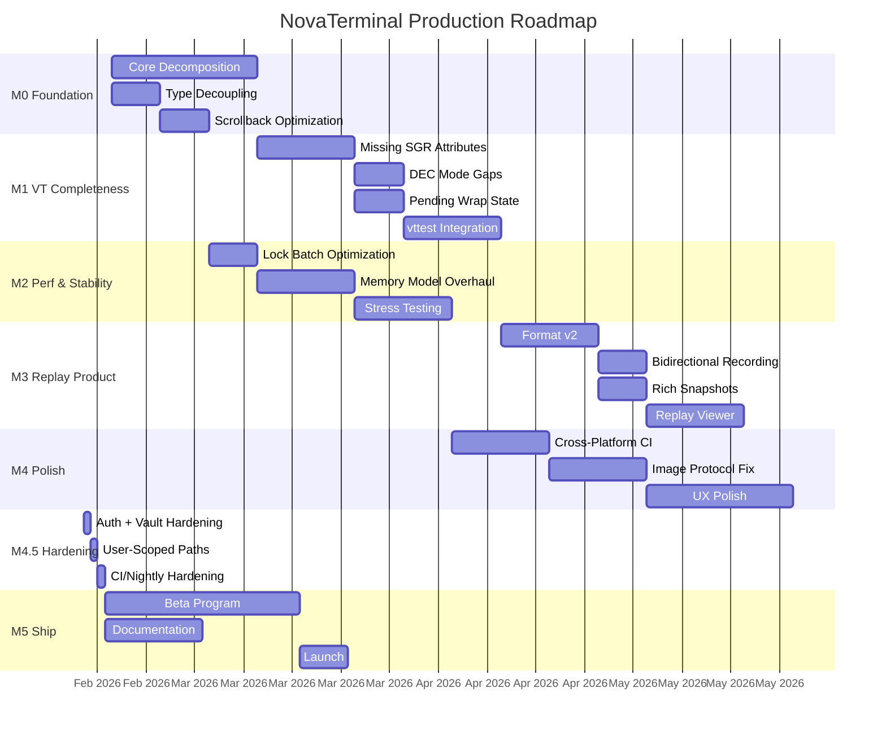
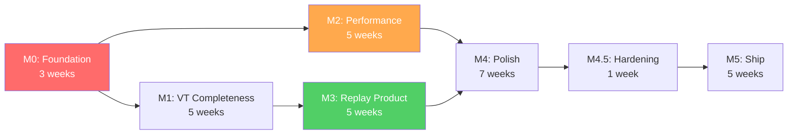

# NovaTerminal — Production Roadmap

> **Goal**: Production-ready, monetization-ready terminal. Keep revenue model options open until the product is solid.
> **Baseline**: Architectural review completed 2026-02-13. Current state: functional prototype with working VT parser, Reflow, replay infra, glyph atlas rendering, and cross-platform PTY.

---

## Progress Snapshot *(updated 2026-02-13)*

| Milestone | Status | Evidence | Notes |
|---|---|---|---|
| **M0** Foundation | **Partially complete** | `feature/m0-foundation` (older branch), current `main` codebase | `TermColor` and `CircularBuffer` work are present; full `TerminalBuffer` decomposition remains open |
| **M1** VT Completeness | **Merged** | `235d00d` (`Merge feature/m1-vt-completeness`) | DEC mode and SGR completeness delivered in merged branch |
| **M2** Perf & Stability | **Merged (core scope)** | `04221f4` (`Merge feature/m2-performance-stability`) | Batch write/parser + memory model updates landed; remaining perf-gate/fuzz hardening is still trackable separately |
| **M3** Replay Product | **Merged (core scope)** | `1eb70b5` (`Merge feature/m3-replay-product`) | Replay v2 format, reader/writer aliases, richer snapshots, and replay stability landed |
| **M4** Cross-Platform Polish | **Merged** | `417ebb7` (`Merge feature/m4-cross-platform-polish`) | CI matrix/AOT/PTY smoke, ConPTY image fallback docs+logic, and UX polish set landed |
| **M4.5** Production Hardening | **Merged** | `1fabee7`, `5ed9993`, `e50013f`, `25344d9` | Removed password injection, canonicalized vault keys, moved writable paths to LocalAppData, switched parity to runtime artifacts, corrected nightly stress filters, synced execution docs |
| **M5** Ship | **Not started** | n/a | Beta program, launch docs/site, and release motion still pending |

**Latest verification (2026-02-13):** `dotnet test NovaTerminal.Tests/NovaTerminal.Tests.csproj -c Release` passed (`159/159`), plus replay and stress/perf/latency filtered runs passed; `tests/NovaTerminal.ExternalSuites` builds in Release.

---

## Roadmap Overview



---

## M0 — Structural Foundation *(3 weeks)*

**Status (2026-02-13):** Partial. Core decoupling/ring-buffer elements are in place, but full decomposition target is still open.

**Purpose**: Eliminate the four catastrophic tech debt risks identified in the review. Every subsequent milestone depends on this being clean.

### M0.1 — TerminalBuffer Decomposition

**Current state**: 2,489 LOC monolith owning cursor, grid, scrollback, reflow, modes, search, images, and grapheme logic.

**Target split**:

| New Class | Responsibilities | Extracted From |
|---|---|---|
| `BufferGrid` | Viewport array, scrollback ring buffer, cell access (`GetCell`, `GetRowAbsolute`, `GetRowSnapshot`) | ~400 LOC |
| `CursorState` | Position, per-screen saved cursor, SGR attributes (fg, bg, bold, inverse, hidden) | ~200 LOC |
| `ReflowEngine` | Pure function: `(oldGrid, oldCols, newCols) → newGrid`. Stateless. | `Reflow()` ~660 LOC |
| `ModeState` | Mouse modes, DECAWM, DECCKM, origin mode, bracketed paste, sync output | ~80 LOC |
| `TerminalBuffer` (façade) | Orchestrates the above. Thin delegation. Owns the `ReaderWriterLockSlim`. | Remaining ~1,100 LOC |

**Tasks**:
- [ ] Extract `BufferGrid` with ring buffer scrollback (replaces `List<TerminalRow>` + `RemoveAt(0)`)
- [ ] Extract `CursorState` struct
- [ ] Extract `ReflowEngine` as a static pure function
- [ ] Extract `ModeState` record
- [ ] Make `TerminalBuffer` a thin façade
- [ ] All existing tests pass without modification (API surface unchanged)

**Trade-offs**:
- ⬆️ Maintainability, testability, future GPU renderer feasibility
- ⬇️ 1-2 weeks of pure refactoring with zero user-visible improvement
- ⚠️ Risk: Reflow is deeply entangled with scrollback. Extracting it cleanly requires careful handling of the scrollback+viewport boundary

**Exit criteria**: All 23+ existing test files pass. `TerminalBuffer.cs` < 500 LOC.

---

### M0.2 — Avalonia Type Decoupling

**Current state**: `TerminalCell` uses `Avalonia.Media.Color`. Core depends on Avalonia at the struct level.

**Tasks**:
- [ ] Create `TermColor` struct: `{ byte R, G, B, A }` with implicit conversion to/from `Avalonia.Media.Color`
- [ ] Replace `Color` in `TerminalCell`, `TerminalBuffer`, `SavedCursorState`, `TerminalTheme`
- [ ] Verify headless replay runs without Avalonia reference (test project only references Core)

**Trade-offs**:
- ⬆️ Enables WASM, headless, GPU renderer targets
- ⬇️ ~100 call sites to update. Mechanical but tedious
- ⚠️ Must not regress color fidelity (ensure lossless roundtrip)

**Exit criteria**: `NovaTerminal.Core` namespace compiles without `using Avalonia.Media` (except `TerminalView` and `TerminalDrawOperation` which remain in the renderer layer).

---

### M0.3 — Scrollback Ring Buffer

**Current state**: `List<TerminalRow>` with `RemoveAt(0)` — O(n) eviction.

**Tasks**:
- [ ] Implement `CircularBuffer<TerminalRow>` with O(1) push/evict
- [ ] Replace `_scrollback` in `BufferGrid`
- [ ] Benchmark: 100K-line scrollback, continuous output, measure eviction cost

**Trade-offs**:
- ⬆️ O(1) eviction, predictable performance at scale
- ⬇️ Slightly more complex indexing (modular arithmetic)
- ⚠️ Must preserve absolute row addressing for `GetRowAbsolute()` and image `CellY` tracking

**Exit criteria**: `cat 10MB_file` with 100K scrollback completes with < 50ms total eviction overhead (vs current ~seconds).

---

## M1 — VT Completeness *(5 weeks)*

**Status (2026-02-13):** Merged to `main` (`235d00d`).

**Purpose**: Reach the VT compliance level required for correct rendering of modern TUI applications (bat, delta, neovim, tmux, htop, midnight commander).

### M1.1 — Missing SGR Attributes *(2 weeks)*

| Attribute | SGR Code | Used By | Priority |
|---|---|---|---|
| Italic | `SGR 3` | bat, delta, neovim | **P0** |
| Strikethrough | `SGR 9` | rich, bat | **P0** |
| Underline variants | `SGR 4:0-5` | kitty, foot | **P1** |
| Overline | `SGR 53` | rare | **P2** |
| Dim/Faint | `SGR 2` | ls --color, bat | **P0** |
| Blink | `SGR 5/6` | rare, but spec | **P2** |

**Tasks**:
- [ ] Add `IsItalic`, `IsStrikethrough`, `IsDim`, `UnderlineStyle` to `TerminalCell` (use the flags byte from M0)
- [ ] Implement in `HandleSgr()` (parser)
- [ ] Implement rendering: italic via `SKFont.SkewX`, strikethrough/underline via line drawing
- [ ] Golden master tests for each attribute

**Trade-offs**:
- ⬆️ Needed for any real-world usage beyond basic shells
- ⬇️ Increases `TerminalCell` complexity (mitigated by flags byte)
- ⚠️ Italic rendering via skew looks poor at small sizes. May need italic font variant discovery.

---

### M1.2 — DEC Mode Gaps *(1 week)*

| Mode | Code | Impact |
|---|---|---|
| Origin mode | `?6` | tmux pane scrolling |
| Focus events | `?1004` | neovim focus-gained/lost |
| Reverse video | `?5` | Rare but spec-required |
| DECOM cursor constraint | — | Cursor origin relative to scroll region |

**Tasks**:
- [ ] Implement `?6` (DECOM) with cursor constraint to scroll region
- [ ] Implement `?1004` (focus event reporting: `\e[I` / `\e[O`)
- [ ] Add golden master tests with tmux and neovim replay fixtures

---

### M1.3 — Pending Wrap State *(1 week)*

**Current state**: When cursor reaches column 79 (last column), the next character wraps immediately. DEC spec says the cursor should stay at column 79 in a "pending wrap" state — wrapping only when the *next printable character* arrives.

**Tasks**:
- [ ] Add `bool _pendingWrap` flag to `CursorState`
- [ ] Modify `WriteGraphemeInternal()` to set `_pendingWrap` instead of immediate wrap
- [ ] Clear `_pendingWrap` on `CUP`, `CR`, `BS`, `HT`, and other cursor movement sequences
- [ ] Test: write at col 79, `ESC[C` (cursor forward), verify no wrap

**Trade-offs**:
- ⬆️ Fixes subtle wrapping bugs visible in vim and neovim
- ⬇️ Touches the most sensitive code path in the buffer
- ⚠️ Must not break existing reflow tests (reflow relies on `IsWrapped` semantics)

---

### M1.4 — vttest Integration *(2 weeks)*

**Tasks**:
- [ ] Record vttest menu sessions as replay fixtures
- [ ] Create automated comparison against expected output
- [ ] Add to CI as a gating check
- [ ] Document which vttest sections pass/fail

**Exit criteria for M1**: bat, delta, neovim, tmux, htop, midnight commander all render correctly. vttest core sections pass.

---

## M2 — Performance & Stability *(5 weeks)*

**Status (2026-02-13):** Merged core milestone work to `main` (`04221f4`), with additional perf-hardening items still available for follow-up.

**Purpose**: Achieve performance parity with WezTerm/Windows Terminal on throughput benchmarks. Eliminate GC-induced frame drops.

### M2.1 — Lock Batch Optimization *(1 week)*

**Current state**: `WriteChar()` acquires/releases write lock **per character**. `AnsiParser.Process()` calls `WriteChar()` in a loop.

**Change**: Hoist the write lock to `AnsiParser.Process()` level. One lock acquisition per PTY read chunk (typically 4KB), not per character.

**Tasks**:
- [ ] Add `TerminalBuffer.EnterBatchWrite()` / `ExitBatchWrite()` that wrap `Lock.EnterWriteLock()`
- [ ] Modify `AnsiParser.Process()` to call `EnterBatchWrite()` once at start
- [ ] Remove per-method lock acquisition from `WriteChar()`, `WriteContent()`, etc. (internal methods assume lock held)
- [ ] Keep `Invalidate()` call at end of batch, not per-character
- [ ] Benchmark: `cat 10MB_file` before/after

**Trade-offs**:
- ⬆️ Expected 2-5× throughput improvement
- ⬇️ Increases lock hold duration (blocks renderer during parsing)
- ⚠️ Must not hold lock during `Task.Delay` or blocking calls. Careful with `EndSync()` inside `Invalidate()`

**Exit criteria**: `cat 10MB` < 2 seconds. Lock hold time per batch < 5ms.

---

### M2.2 — Memory Model Overhaul *(2 weeks)*

**Tasks**:
- [ ] Pack `TerminalCell` booleans into `byte Flags` (save ~7 bytes/cell)
- [ ] Remove `Color Foreground/Background` from `TerminalCell`; resolve at render time from `FgIndex`/`BgIndex` + theme (save 8 bytes/cell)
- [ ] Move `string? Text` to side table `Dictionary<(int row, int col), string>` (save 8 bytes/cell on 99% of cells)
- [ ] Target cell size: ≤ 12 bytes (from current ~32 bytes)
- [ ] 100K scrollback at 200 cols: 240 MB → ~240 MB (with overhead) down from ~640 MB

**Trade-offs**:
- ⬆️ 2.5× memory reduction enables larger scrollback
- ⬇️ Indirection for `Text` field adds complexity to grapheme handling
- ⬇️ Color resolution at render time adds per-cell cost during rendering
- ⚠️ Side table for graphemes must be cleaned up when rows are evicted from scrollback

> [!IMPORTANT]
> This is the riskiest refactor in the roadmap. The `TerminalCell` struct is touched by every module. Implement behind a feature flag and A/B test performance.

---

### M2.3 — Stress Testing Framework *(2 weeks)*

**Tasks**:
- [ ] Create `NovaTerminal.Benchmarks` project using BenchmarkDotNet
- [ ] Benchmarks: `ParseThroughput`, `ReflowLargeBuffer`, `RenderFrameTime`, `ScrollbackEviction`
- [ ] Integrate `dotnet-counters` for GC metrics
- [ ] Add CI performance regression gate: fail if any benchmark regresses > 10%
- [ ] Fuzz `AnsiParser.Process()` with SharpFuzz (nightly CI, 10M iterations)
- [ ] Memory leak test: 10K resize cycles, assert working set stable

**Exit criteria for M2**: `cat 10MB` < 2s. 60 FPS sustained under htop on 128-core display. No GC pauses > 10ms. Zero crashes under 10M fuzz iterations.

---

## M3 — Replay as Product Feature *(5 weeks)*

**Status (2026-02-13):** Merged core replay product work to `main` (`1eb70b5`).

**Purpose**: Transform the replay infrastructure from a testing tool into a user-facing product differentiator. This is the strongest monetization lever.

### M3.1 — Replay Format v2 *(2 weeks)*

**Current state**: JSONL with manual parsing. No version header, no terminal size, no resize events.

**v2 format**:
```
# NOVA-REPLAY v2
# cols=120 rows=30
# recorded=2026-02-13T12:00:00Z
# shell=pwsh.exe
{"t":0,"type":"data","d":"BASE64..."}
{"t":150,"type":"resize","cols":80,"rows":24}
{"t":200,"type":"data","d":"BASE64..."}
{"t":300,"type":"input","d":"BASE64..."}   // bidirectional
```

**Tasks**:
- [ ] Design v2 format specification document
- [ ] Implement `ReplayWriter` (replaces `PtyRecorder`) with v2 format
- [ ] Implement `ReplayReader` (replaces `ReplayRunner`) with v1 backward compatibility
- [ ] Add resize event recording in `TerminalView.OnSizeChanged()`
- [ ] Store initial terminal dimensions in header
- [ ] Unit tests: v1→v2 migration, roundtrip, corrupt file handling

**Trade-offs**:
- ⬆️ Deterministic replay across all scenarios (resize, size mismatch)
- ⬇️ Breaking change to golden master fixtures (must regenerate)
- ⚠️ Format must be designed for long-term stability — version field enables future extension

---

### M3.2 — Bidirectional Recording *(1 week)*

**Tasks**:
- [ ] Record user input (keystrokes) alongside PTY output in v2 format
- [ ] `"type":"input"` events capture raw bytes sent to PTY
- [ ] No privacy: input recording is opt-in, clearly indicated in UI

**Trade-offs**:
- ⬆️ Enables full session reproduction ("I typed X and it broke")
- ⬇️ Privacy concern: passwords typed in terminal are recorded
- ⚠️ Must add clear UI indicator when recording. Consider auto-redacting `password:` prompts

---

### M3.3 — Rich Snapshots *(1 week)*

**Tasks**:
- [ ] Extend `BufferSnapshot` to include: cell attributes (bold, italic, fg/bg index), cursor attributes, mode flags, scroll region
- [ ] Update `GoldenMaster.AssertMatches()` to compare attributes
- [ ] Regenerate all golden master fixtures

**Trade-offs**:
- ⬆️ Golden masters now verify visual fidelity, not just text content
- ⬇️ Golden masters become more brittle (any attribute change requires fixture update)
- ⚠️ Add `--update-golden` flag to test runner for easy regeneration

---

### M3.4 — Replay Viewer UI *(2 weeks)*

**Tasks**:
- [ ] Add "Replay" tab/mode in NovaTerminal: load `.novarec` file, play back with timeline scrubber
- [ ] Play/pause/seek/speed controls
- [ ] Export replay to GIF/MP4 (via Skia frame capture)
- [ ] Share replay file via drag-and-drop or menu

**Trade-offs**:
- ⬆️ Transforms NovaTerminal from "terminal" to "terminal + DevOps collaboration tool"
- ⬇️ Significant UI work (2 weeks)
- ⚠️ Must handle seeks correctly — requires re-parsing from start to seek point (no random access in byte-stream format)

**Exit criteria for M3**: Record a tmux session with resizes → share file → replay on another machine → output identical. Viewer with play/pause/seek working.

---

## M4 — Cross-Platform Polish *(7 weeks)*

**Status (2026-02-13):** Merged to `main` (`417ebb7`).

### M4.1 — Cross-Platform CI *(2 weeks)*

**Tasks**:
- [ ] GitHub Actions matrix: Windows, Linux (Ubuntu), macOS (ARM)
- [ ] Build + test + AOT publish on all three platforms
- [ ] Golden master parity tests: same replay → same snapshot on all platforms
- [ ] Platform-specific PTY smoke tests

**Trade-offs**:
- ⬆️ Catches platform divergence early
- ⬇️ CI build time increases 3×
- ⚠️ macOS ARM runners may have limited availability in free tier

---

### M4.2 — Image Protocol Windows Fix *(2 weeks)*

**Current state**: ConPTY filters Kitty/iTerm2 APC/DCS sequences on Windows.

**Options**:

| Option | Effort | Reliability |
|---|---|---|
| A. Bypass ConPTY (direct VT handle) | 3 weeks | High but Windows-only |
| B. Named pipe sideband channel | 2 weeks | Medium, requires app protocol |
| C. Accept limitation, document it | 0 | Low user satisfaction |
| **D. Detect ConPTY filtering, fall back to Sixel** | **1 week** | **Good enough for MVP** |

**Recommendation**: Option D for M4, option A/B deferred to post-launch.

**Tasks**:
- [ ] Detect ConPTY stripping (send test sequence, check if echoed)
- [ ] Document image protocol support matrix per platform
- [ ] Sixel fallback for Windows (already partially implemented)

---

### M4.3 — UX Polish *(3 weeks)*

**Tasks**:
- [ ] Cursor styles: block, beam, underline (per profile)
- [ ] Cursor blink animation
- [ ] Bell notification (audio + visual flash)
- [ ] OSC 7 (CWD reporting) → show in tab title
- [ ] OSC 8 (hyperlinks) → clickable URLs
- [ ] Smooth scrolling animation
- [ ] Drag-and-drop file path insertion
- [ ] Command palette completeness (all settings accessible)
- [ ] Keyboard shortcut customization
- [ ] Theme import from iTerm2/Windows Terminal/Alacritty formats

**Trade-offs**:
- ⬆️ "Feels premium" — critical for first impressions
- ⬇️ Large surface area, high test burden
- ⚠️ Each feature is small but they compound. Timebox strictly.

**Exit criteria for M4**: NovaTerminal runs identically on Win/Lin/Mac. A new user can install, configure, and use it for daily development work without hitting missing features.

---

## M4.5 — Production Hardening *(completed follow-up sweep)*

**Status (2026-02-13):** Merged to `main` via `1fabee7`, `5ed9993`, `e50013f`, `25344d9`.

**Purpose**: Close security, data-path, and CI correctness gaps discovered after core M4 landing.

### Delivered

- Removed terminal-output-triggered password auto-injection; SSH password auth is now manual interactive only.
- Canonicalized SSH vault keying to `SSH:PROFILE:{profileId}` with legacy key fallback and migration.
- Moved runtime writable files to user-scoped LocalAppData paths with one-time non-destructive migration.
- Switched parity comparison to runtime-generated replay artifacts; parity compare fails when artifacts are missing.
- Fixed nightly stress lane to run real `Stress`, `Performance`, and `Latency` categories (instead of empty `ReplayStress` filter).
- Synced execution documentation in `docs/PRODUCTION_EXECUTION_PLAN.md`.

**Exit criteria**: met.

---

## M5 — Ship *(5 weeks)*

**Status (2026-02-13):** Pending.

### M5.1 — Beta Program *(4 weeks)*

**Tasks**:
- [ ] Private beta (50-100 users), recruited from dev communities
- [ ] Telemetry: crash reports, performance metrics (opt-in)
- [ ] Bug triage process: P0 bugs block launch, P1 bugs tracked, P2 deferred
- [ ] Weekly beta builds with changelog

---

### M5.2 — Documentation *(2 weeks, parallel with beta)*

**Tasks**:
- [ ] User documentation site (keybindings, configuration, profiles)
- [ ] Replay format specification (public, versioned)
- [ ] API documentation for future plugin system
- [ ] Contributing guide updates

---

### M5.3 — Launch *(1 week)*

**Tasks**:
- [ ] Public release on GitHub under the MIT license
- [ ] Website with download links, feature highlights, replay demo
- [ ] Announce on HackerNews, Reddit r/commandline, Twitter/X

---

## Milestone Summary

| Milestone | Duration | Outcome | Risk Level |
|---|---|---|---|
| **M0** Foundation | 3 weeks | Clean architecture, no tech debt blockers | Medium (large refactor) |
| **M1** VT Completeness | 5 weeks | Modern TUI apps render correctly | Low-Medium |
| **M2** Performance | 5 weeks | Competitive throughput, no GC drops | Medium-High (memory overhaul) |
| **M3** Replay Product | 5 weeks | Session recording as user feature | Low |
| **M4** Polish | 7 weeks | Cross-platform, image protocols, UX | Medium |
| **M4.5** Hardening | 1 week | Security, runtime-path, and CI/nightly correctness gates closed | Low-Medium |
| **M5** Ship | 5 weeks | Public release with beta feedback | Low |
| **Total** | **~31 weeks** | | |

---

## Critical Path



**M0 is the one non-negotiable prerequisite.** M1 and M2 can run in parallel after M0. M3 depends on M1 (needs correct VT for meaningful replay). M4 depends on both M2 and M3. M4.5 hardening should complete before M5.

**Fastest path to beta**: M0 → M1+M2 (parallel) → M3 → M4.5 → M5 (skip most M4 polish). This gives a *functional* beta in ~19 weeks but with rough edges.

**Recommended path**: Full sequence. 31 weeks to a polished launch.

---

## Trade-Off Decision Points

These are decisions you should make *before* starting each milestone:

### Before M0
> **Q: How aggressive is the TerminalBuffer decomposition?**
> - Option A: Full extraction (5 new classes) — cleanest, highest risk, 3 weeks
> - Option B: Extract only ReflowEngine + ring buffer — 80% of the benefit, 1.5 weeks
> - **Recommendation**: Option B. Get the ring buffer and stateless Reflow. Defer full decomposition.

### Before M1
> **Q: What is the VT compliance target?**
> - Option A: "Works with the top 20 TUI apps" — pragmatic, testable
> - Option B: "Passes vttest completely" — purist, 2-3× more work
> - **Recommendation**: Option A. Target app-level correctness, not spec-level perfection.

### Before M2
> **Q: Is the `TerminalCell` memory overhaul worth the risk?**
> - Option A: Full overhaul (12 bytes/cell) — maximum savings, touching every module
> - Option B: Flags byte only (25 bytes/cell) — 20% savings, low risk
> - Option C: Defer entirely until scrollback > 100K is a real user request
> - **Recommendation**: Option B now, Option A only if users report memory issues.

### Before M3
> **Q: Is replay a user feature or a testing tool?**
> - If user feature → invest in v2 format, viewer UI, sharing (5 weeks)
> - If testing tool → keep current infra, just expand golden fixtures (1 week)
> - **Recommendation**: User feature. This is the strategic differentiator.

### Before M5
> **Q: What license?**
> - **Decision**: MIT
> - Rationale: prioritize broad adoption, low contribution friction, and straightforward downstream use.

---

## Monetization Readiness Checklist

These capabilities must exist *before* choosing a revenue model:

| Capability | Needed For | Milestone |
|---|---|---|
| Replay recording + sharing | SaaS collaboration tool | M3 |
| Session audit logging | Enterprise compliance | M3 |
| Credential vault integration (canonicalized + migrated) | Enterprise security | M4.5 |
| No output-triggered credential injection | Security baseline | M4.5 |
| Plugin/extension API | Marketplace revenue | Post-launch |
| Telemetry (opt-in) | Usage data for pricing | M5 |
| Cross-platform parity | Broad market | M4 |
| Runtime-generated parity artifacts in CI | Regression trustworthiness | M4.5 |
| Auto-update mechanism | Subscription model | Post-launch |

> [!TIP]
> The fastest path to *validating* monetization is: ship M0-M3 plus M4.5 hardening, give the replay feature to 10 DevOps teams, measure adoption. If they use it daily → enterprise SaaS. If they ignore it → pivot to open-core with premium themes/plugins.
